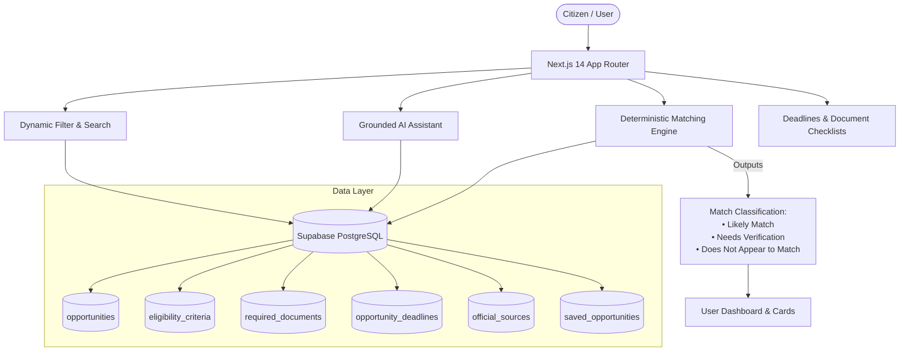

# OpportunityX-AI 🇮🇳
> **Zero-Hallucination Citizen Benefits Discovery & Deterministic Opportunity Matching Engine**

[](https://nextjs.org/)
[](https://www.typescriptlang.org/)
[](https://tailwindcss.com/)
[](https://supabase.com/)
[](https://opensource.org/licenses/MIT)

---

## 📌 Executive Summary

Every year, thousands of crores in public scholarships, welfare schemes, and skill grants lapse unclaimed because citizens find official portals fragmented, criteria opaque, and processes intimidating. When generative AI is applied carelessly to public benefits, it frequently **hallucinates** eligibility criteria, deadlines, and benefits, leading to citizen rejection or missed opportunities.

**OpportunityX-AI** solves this through a **hybrid deterministic intelligence architecture**:
1. **Deterministic Rule Engine**: Zero-hallucination eligibility matching based strictly on verified rules stored in Supabase PostgreSQL. It categorizes matches into `Likely Match`, `Needs Verification`, and `Does Not Appear to Match`, complete with audit trails of which profile attributes matched and what must be verified.
2. **Grounded AI Assistant**: Context-bound assistant powered by the verified opportunity database. It answers queries, explains official criteria, directs users to primary government portals, and explicitly acknowledges when documentation requires manual verification.
3. **Citizen Lifecycle Tracker**: Real-time deadline countdowns (`Closing Soon`, `Upcoming`, `Open`, `Deadline Passed`), interactive document checklists with category tags, and saved opportunity management.
4. **Sandboxed Admin/Demo Portal**: Administrative dashboard for verifying official sources, updating application cycles, and maintaining high data integrity without impersonating official government portals.

---

## 🛠️ Technology Stack

| Layer | Technology | Purpose |
|---|---|---|
| **Framework** | [Next.js 14](https://nextjs.org/) (App Router) | High-performance React framework with SSR, SSG, and API route handlers |
| **Language** | [TypeScript](https://www.typescriptlang.org/) | End-to-end type safety across schemas, API payloads, and state models |
| **Styling** | [Tailwind CSS](https://tailwindcss.com/) | Responsive design system, accessible color contrast, and micro-interactions |
| **Icons** | [Lucide React](https://lucide.dev/) | Clean, accessible icon primitives |
| **Database** | [Supabase](https://supabase.com/) (PostgreSQL 15) | Relational database with pg_trgm search, UUID extensions, and Row Level Security |
| **Auth & Security**| Supabase Auth + Local Profile Engine | Safe anonymous fallback with optional Supabase authenticated profile synchronization |
| **Testing** | Playwright / Headless Chromium | Automated 20-point end-to-end QA test suite (`scripts/qa-browser-test.js`) |

---

## 🏛️ System Architecture



---

## 🚀 Quickstart & Local Setup

### 1. Prerequisites
- **Node.js**: v18.17.0 or higher
- **npm**: v9.0.0 or higher (or pnpm / yarn)
- **Supabase Account**: (Optional for local testing; demo data operates offline out-of-the-box via local fallback)

### 2. Clone the Repository
```bash
git clone https://github.com/your-username/OpportunityX-AI.git
cd OpportunityX-AI
```

### 3. Install Dependencies
```bash
npm install
```

### 4. Configure Environment Variables
Copy `.env.example` to create `.env.local`:
```bash
cp .env.example .env.local
```

Edit `.env.local` with your configuration:
```env
# Public Supabase URL (from Supabase Dashboard -> Project Settings -> API)
NEXT_PUBLIC_SUPABASE_URL=https://your-project-ref.supabase.co

# Public Supabase Anon Key (safe for client-side with RLS)
NEXT_PUBLIC_SUPABASE_ANON_KEY=your-anon-jwt-token-here

# Optional: Supabase Service Role Key (NEVER commit or expose to frontend)
SUPABASE_SERVICE_ROLE_KEY=your-service-role-secret-key-here
```

> **Note**: If Supabase credentials are not provided or the remote database is unreachable, OpportunityX-AI automatically falls back gracefully to its verified local seed catalog without crashing.

### 5. Run the Local Development Server
```bash
npm run dev
```

Open [http://localhost:3000](http://localhost:3000) in your browser.

---

## 🗄️ Supabase Database Setup

To provision your own Supabase instance with full schema, constraints, indexes, and sample opportunities:

1. Create a new project at [supabase.com](https://supabase.com).
2. Open the **SQL Editor** in the Supabase Dashboard.
3. Run the schema script located at [`supabase/schema.sql`](supabase/schema.sql):
   - Creates `opportunities`, `eligibility_criteria`, `required_documents`, `opportunity_deadlines`, `official_sources`, `user_profiles`, and `saved_opportunities`.
   - Provisions Row Level Security (RLS) policies.
   - Installs `uuid-ossp` and `pg_trgm` extensions.
4. Run the seed data script located at [`supabase/seed.sql`](supabase/seed.sql) to populate verified national scholarships, state schemes, and fellowship opportunities.
5. In **Project Settings** > **API**, copy the `URL` and `anon public` key to `.env.local`.

---

## 🔒 Security, RLS & Secret Hygiene

- **Zero-Secret Commits**: All sensitive keys (`.env`, `.env.local`, `.env*.local`, service account credentials) are strictly ignored in `.gitignore`. Only `.env.example` with non-functional placeholders is tracked.
- **Row Level Security (RLS)**:
  - Public can read verified opportunities, criteria, official sources, and deadlines.
  - Citizens can only read, insert, and delete their own saved opportunities and profile records (`auth.uid() = user_id`).
- **No Client-Side Service Keys**: All client requests use the restricted `anon` key. Privileged admin actions are isolated behind verified API handler routes.

---

## 🧪 Automated Testing & QA

OpportunityX-AI includes an automated 20-point end-to-end browser test suite verifying critical citizen flows:
- Scholarship search & real-time filter combinations
- Detail modal rendering & official source links
- Deterministic profile matching engine
- Document checklist interactivity & persistent tracking
- Saved opportunities bookmarking & deletion
- Deadline visual badges (`Closing Soon`, `Upcoming`, `Open`, `Deadline Passed`)
- Mobile viewport responsive layout integrity

Run the browser QA test:
```bash
node scripts/qa-browser-test.js
```

---

## 📦 Production Deployment

### Deploying to Vercel (Recommended)
1. Push your repository to GitHub.
2. Sign in to [Vercel](https://vercel.com) and click **Add New Project**.
3. Import the `OpportunityX-AI` repository.
4. In the **Environment Variables** section, add:
   - `NEXT_PUBLIC_SUPABASE_URL`
   - `NEXT_PUBLIC_SUPABASE_ANON_KEY`
5. Click **Deploy**. Vercel will automatically build the Next.js production bundle.

### Deploying to Alternative Hosts (Docker / Node VPS)
```bash
npm run build
npm run start
```

---

## ⚖️ Disclaimer & Compliance
- **Not an Official Government Portal**: OpportunityX-AI is an independent citizen-advancement initiative developed for hackathons and research. It aggregates public government schemes and links directly to official national portals (`scholarships.gov.in`, `myscheme.gov.in`, state portals).
- **Verification Notice**: OpportunityX-AI never guarantees eligibility or disbursals. Users must always verify requirements and submit final applications on the respective nodal government authority's official domain.

---

## 📄 License
This project is open-source under the [MIT License](LICENSE).
